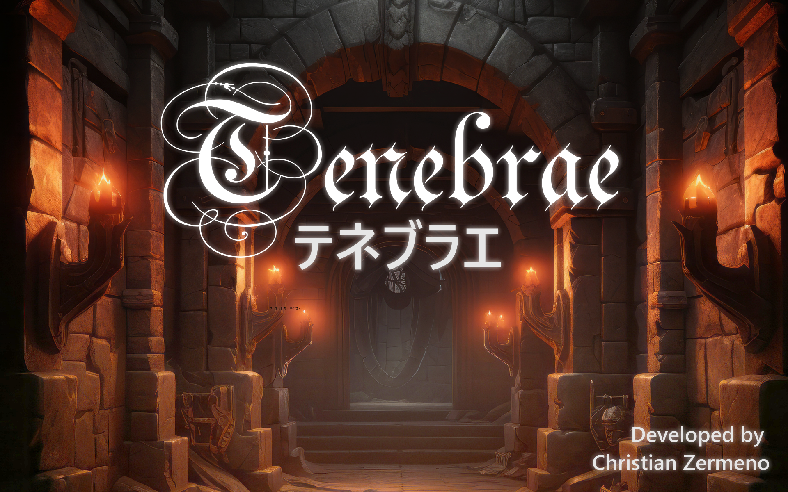

# テネブラエ

テネブラエはシャドウマッピングを実装したDirectXFPSゲームです。

このゲームはHAL 冬の3校学内コンテストで銀賞を受賞しました。よりリアル世界を描くためにシャドウマッピング実装しました。シャドウ マッピングはポイント ライトで動作し、現在は一方向にのみシャドウを投影しますが、キューブ マップ シャドウ マッピングを使用して全方向にシャドウを投影する予定です。

直感的にオブジェクトとの当たり判定を認識させるためこのゲームではボックスコライダーを使用しています。「Tiled」 といったマップ エディターを使用して、壁のコライダーを簡単に調整できる機能を開発しました。このコードは、Tiled によって生成された XML ファイルを読み取り、そのデータをゲームにロードしてボックス コライダーを構築します。Mayaでのコライダーやアイテムの編集と、生成されたファイルのゲーム内での読み込みを実装する予定です。

